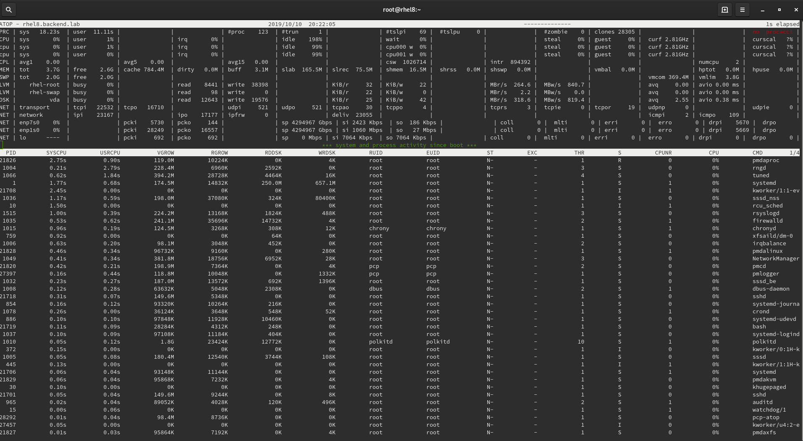

# Performance Co-Pilot

Performance Co-Pilot is a system performance analysis toolkit that allows:

* **Collect** collect performance metrics from your systems efficiently. Collate metrics from multiple hosts and a variety of operating systems. Everything you need is already included in the major distributions: Fedora, RHEL, Debian, SUSE, Ubuntu, Gentoo.
* **Analyze** analyze systems' performance metrics in real-time or using historical data. Compare performance metrics between different hosts and different intervals. Observe trends and identify abnormal patterns. 
* **Extend**  extend the collected performance metrics in a simple way. PCP offers a multitude of APIs and libraries to extract and make use of performance metrics from your own application. 

## The basic

To install it:

```
[root@rhel8 ~]# yum install pcp pcp-gui pcp-system-tools pcp-doc pcp-webjs pcp-webapi pcp-webapp-vector pcp-webapp-grafana pcp-webapp-graphite
```

After installing we need to start the **performance metrics collector daemon** or **pmcd**:

```bash
[root@rhel8 ~]# systemctl start pmcd --now
[root@rhel8 ~]#
```

Then start the **performance metrics logger** or **pmlogger**:

```bash
[root@rhel8 ~]# systemctl start pmlogger --now
[root@rhel8 ~]# 
```

* **pmcd** collect performance statistics.
* **pmlogger** store the metrics in files so they can be viewed later.

**pmlogger** stores data:

```bash
[root@rhel8 ~]# ls -lh /var/log/pcp/pmlogger/rhel8.backend.lab/
total 676K
-rw-r--r--. 1 pcp pcp 350K oct 10 20:02 20191010.19.50.0
-rw-r--r--. 1 pcp pcp  292 oct 10 20:01 20191010.19.50.index
-rw-r--r--. 1 pcp pcp 194K oct 10 20:01 20191010.19.50.meta
-rw-r--r--. 1 pcp pcp  228 oct 10 19:51 Latest
-rw-r--r--. 1 pcp pcp  24K oct 10 19:51 pmlogger.log
[root@rhel8 ~]# 
```

We will have to enable these services if we want them to be started at boot time:

```bash
[root@rhel8 ~]# systemctl enable pmcd
Created symlink /etc/systemd/system/multi-user.target.wants/pmcd.service -> /usr/lib/systemd/system/pmcd.service.
[root@rhel8 ~]# systemctl enable  pmlogger
Created symlink /etc/systemd/system/multi-user.target.wants/pmlogger.service -> /usr/lib/systemd/system/pmlogger.service.
[root@rhel8 ~]# 
```

We can see the available metrics:

```bash
[root@rhel8 ~]# pminfo
...
proc.hog.cpu
proc.hog.mem
proc.hog.disk
[root@rhel8 ~]# pminfo | wc -l
2024
[root@rhel8 ~]# 
```

And we can get information about some particular metric:

```bash
[root@rhel8 ~]# pminfo -dT proc.hog.cpu

proc.hog.cpu
    Data Type: double  InDom: 3.9 0xc00009
    Semantics: instant  Units: / sec
Full Help: Error: One-line or help text is not available
[root@rhel8 ~]# 
```

And we can collect samples for a metric in real time:

```bash
[root@rhel8 ~]# pmval -s 5 mem.util.used

metric:    mem.util.used
host:      rhel8.backend.lab
semantics: instantaneous value
units:     Kbyte
samples:   5
interval:  1.00 sec
              1144036
              1144260
              1144260
              1144260
              1144260
[root@rhel8 ~]# 
```

Using the file where data is stored we can check the collected values for a specific metric:

```bash
[root@rhel8 ~]# pmval -a /var/log/pcp/pmlogger/rhel8.backend.lab/20191010.19.50.0 mem.util.used
...
20:06:05.302              1143052
20:06:06.302              1143052
20:06:07.302              1143052
20:06:08.302              1143052
20:06:09.302              1143052
20:06:10.302              1143052
[root@rhel8 ~]#
```

It is also possible to check several metrics at the same time and in real-time:

```bash
[root@rhel8 ~]# pmdumptext -s 5 -X mem.util.used mem.util.free mem.util.bufmem mem.util.cached
[ 1] mem.util.used
[ 2] mem.util.free
[ 3] mem.util.bufmem
[ 4] mem.util.cached

             Column	     1	     2	     3	     4
Thu Oct 10 20:10:59	 1.17G	 2.79G	 3.24M	 0.82G
Thu Oct 10 20:11:00	 1.17G	 2.79G	 3.24M	 0.82G
Thu Oct 10 20:11:01	 1.17G	 2.79G	 3.24M	 0.82G
Thu Oct 10 20:11:02	 1.17G	 2.79G	 3.24M	 0.82G
Thu Oct 10 20:11:03	 1.17G	 2.79G	 3.24M	 0.82G
[root@rhel8 ~]#
```

We can use the **pcp atop** command to get real time information:



We can use the **pcp iostat** command to get real time information:

```bash
[root@rhel8 ~]# pcp iostat
# Device      rrqm/s  wrqm/s     r/s    w/s    rkB/s    wkB/s avgrq-sz avgqu-sz   await r_await w_await   %util
vda             0.00    0.00    0.00   0.00     0.00     0.00    0.000    0.000    0.00    0.00    0.00    0.00
vda             0.00    0.00    0.00   0.00     0.00     0.00    0.000    0.000    0.00    0.00    0.00    0.00
vda             0.00    0.00    0.00   0.00     0.00     0.00    0.000    0.000    0.00    0.00    0.00    0.00
```