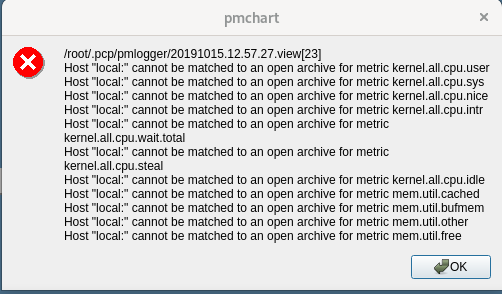

# pmchart

**pmchart** is a graphical tool that allows us to see graphs about **PCP** metrics.

## Creating graphical charts

To create graphical charts we can use **pmchart**. Due to it is a graphical application you will have to use a [remote X Server to display it](start-remotely-graphical-apps.md).

Once you have started **pmchart** you could see on your remote X Server:


Using the ``Open View`` button we can choose what chart we want to see. We are defining a chart so we can add as many chars we want to the in our custom chart.


In that chart we have real time information about:

* IOPS over all disks.
* Memory available.
* CPU utilization.

>  **TIP**: Using the ``File`` menu we can save the chart we have just created as a ``View`` and we will be able to use later without having to create again.

## Reproducing stored data on real time

>  **IMPORTANT**: We will assume that the Graphical environment is started in the server or X11 forwarding is enabled and a remote X Window Server will be used.

We can reproduce what happened in the past in real time. We have to open the file with data using **pmchart**:

```bash
[root@rhel8 ~]# pmchart -a /var/log/pcp/pmlogger/rhel8.backend.lab/20191010.19.50.0
```

That command will open **pmchart** in our remote X Server:


We will open the ``Overview`` graph:


And we will see:


If we click in the ``ARCHIVE`` icon:


We can start reproducing in ''real time'' what happened using the replay buttons.

## Recording specific metrics

We can store specific metrics to replay later.

First we need to create the chart for the metrics we want to store as shown above.

Then we go to ``Record -> Start``:


We can modify the settings, if we need to and after clicking ``Ok`` the data will be recorded in the files shown until we go to ``Record -> Stop``:


If we can see errors similar to:



It seems that ``pmchart`` can not contact ``pmcd`` daemon:

* Verify that ``pmcd`` daemon is running.
* Verify that you do not have problems with **firewalld**. ``pmcd`` is listening on **44321/tcp** port/protocol.
* If ``pmcd`` daemon is running the you will have to check that remote connections are allowed for ``pmcd`` and you will have to the ``PMCD_LOCAL`` variable to 0 in ``/etc/sysconfig/pmcd`` configuration file to allow remote connections. After restarting the ``pmcd`` daemon the errors will dissapear.

To add a host click on the selected part:


Introduce the hostname which has to ve a resolvable one:


And click ``OK``:


You will get rid of those annoying errors.

You can reproduce it running:

```bash
[root@rhel8 ~]# pmafm /root/.pcp/pmlogger/20191015.12.57.27.folio replay
```

Which will launch:


Clicking in ``ARCHIVE``:


Will open a window to change values, if needed and using the play buttons we can reproduce the metrics in real time:


>  **TIP**: Although this example was made in local ``pmchart`` can be run in a remote host and pcp files can be copied to a remote host where they can be analyzed/replayed.