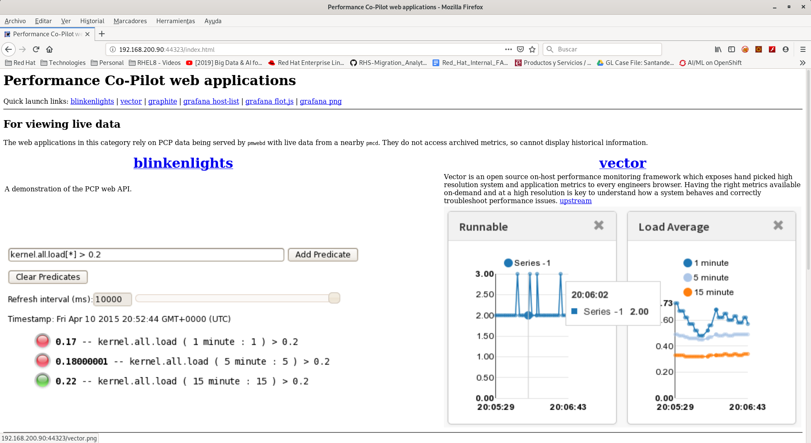

# pmwebd

It is a web tool which includes several graphical tools to see data.

To start it:

```bash
[root@rhel8 ~]# systemctl enable pmwebd
Created symlink /etc/systemd/system/multi-user.target.wants/pmwebd.service → /usr/lib/systemd/system/pmwebd.service.
[root@rhel8 ~]# systemctl start pmwebd --now
[root@rhel8 ~]# 
```

To connect you will need to use a browser to the server port **44323**:


