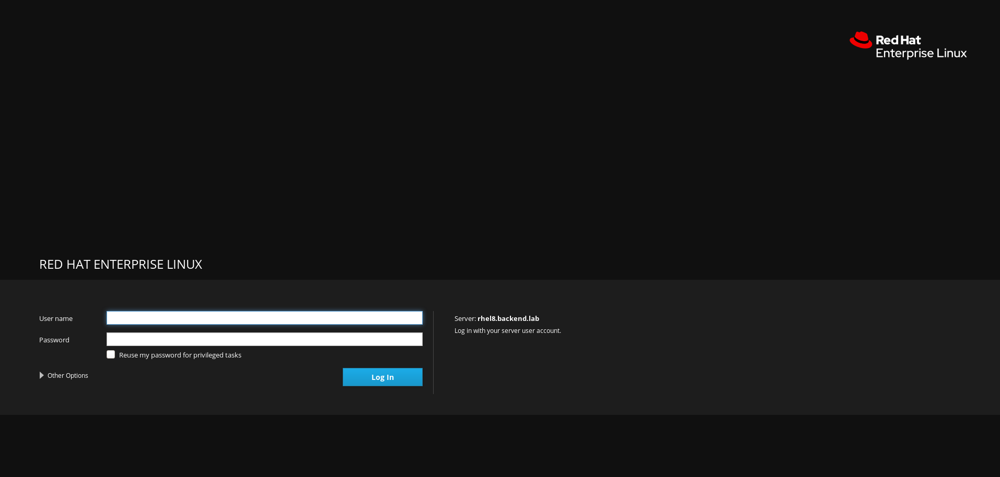
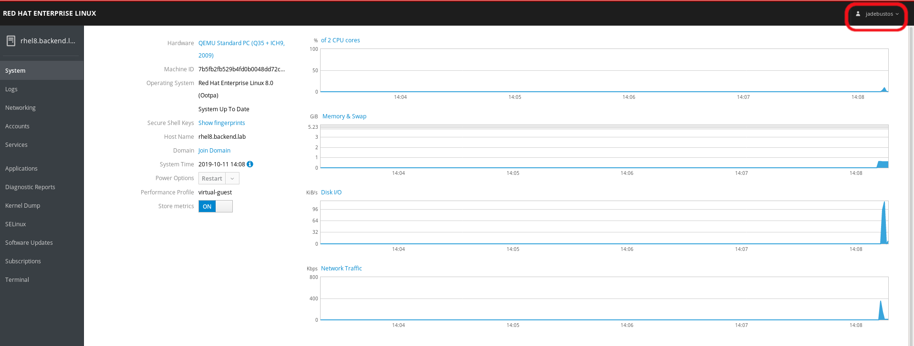
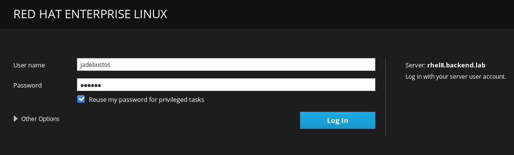
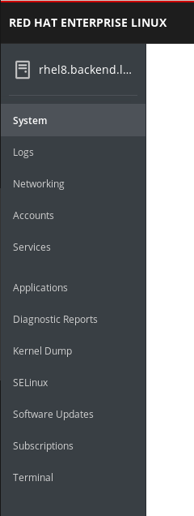
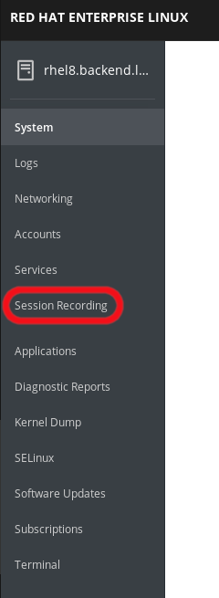

# Cockpit - Web console

## Requirements

A host where you can ssh without password to the RHEL8's root user.

## Deploying the lab

To deploy the lab:

```bash
[root@hostname ansible]# ansible-playbook -i hosts prepare-rhel8-labs.yml --tags web_console
```

# Lab

## Installing Cockpit

To install it:

```bash
[root@rhel8 ~]# yum install cockpit
```

## Enabling Cockpit

You do not need to install any web server, but you need to open the firewall. You do not need to create any rule, cockpit installation does it:

```bash
[root@rhel8 ~]# firewall-cmd --list-all
public (active)
  target: default
  icmp-block-inversion: no
  interfaces: enp1s0
  sources: 
  services: cockpit dhcpv6-client ssh
  ports: 
  protocols: 
  masquerade: no
  forward-ports: 
  source-ports: 
  icmp-blocks: 
  rich rules: 
	
[root@rhel8 ~]#
```

If cockpit is not enabled you will be informed when you connect to the host using ssh:

```bash
[jadebustos@euler ~]$ ssh jadebustos@192.168.200.90
-- WARNING -- This system is for the use of authorized users only. Individuals 
using this computer system without authority or in excess of their authority 
are subject to having all their activities on this system monitored and 
recorded by system personnel. Anyone using this system expressly consents to 
such monitoring and is advised that if such monitoring reveals possible 
evidence of criminal activity system personal may provide the evidence of such 
monitoring to law enforcement officials.

Activate the web console with: systemctl enable --now cockpit.socket

[jadebustos@rhel8 ~]$ 
```

So to enable cockpit:

```bash
[root@rhel8 ~]# systemctl enable --now cockpit.socket
Created symlink /etc/systemd/system/sockets.target.wants/cockpit.socket → /usr/lib/systemd/system/cockpit.socket.
[root@rhel8 ~]# 
```

Now if we connect to the host:

```bash
[jadebustos@euler ~]$ ssh jadebustos@192.168.200.90
-- WARNING -- This system is for the use of authorized users only. Individuals 
using this computer system without authority or in excess of their authority 
are subject to having all their activities on this system monitored and 
recorded by system personnel. Anyone using this system expressly consents to 
such monitoring and is advised that if such monitoring reveals possible 
evidence of criminal activity system personal may provide the evidence of such 
monitoring to law enforcement officials.

Web console: https://rhel8.backend.lab:9090/ or https://192.168.200.90:9090/

Last login: Fri Oct 11 14:02:55 2019 from 192.168.200.1
[jadebustos@rhel8 ~]$
```

## Using Cockpit

Using a web browser:



We can connect with any user, you do not need to be **root** user:



If you want to use your privileges on the system for instance your sudo privileges you will have to check ``Reuse my password for privileged tasks`` on the login page:



## Enabling Cockpit modules

Available options on Cockpit depends on the cockpit modules we have installed on the server:



To see what available cockpit modules do we have:

```bash
[root@rhel8 ~]# yum search cockpit
Updating Subscription Management repositories.
Última comprobación de caducidad de metadatos hecha hace 0:24:52, el vie 11 oct 2019 14:04:47 CEST.
=================================================================================================== Coincidencia exacta en Nombre: cockpit ===================================================================================================
cockpit.x86_64 : Web Console for Linux servers
cockpit.x86_64 : Web Console for Linux servers
================================================================================================= Coincidencia en Resumen , Nombre: cockpit ==================================================================================================
cockpit-ws.x86_64 : Cockpit Web Service
cockpit-ws.x86_64 : Cockpit Web Service
cockpit-pcp.x86_64 : Cockpit PCP integration
cockpit-composer.noarch : Composer GUI for use with Cockpit
cockpit-doc.noarch : Cockpit deployment and developer guide
cockpit-bridge.x86_64 : Cockpit bridge server-side component
cockpit-session-recording.noarch : Cockpit Session Recording
cockpit-bridge.x86_64 : Cockpit bridge server-side component
cockpit-packagekit.noarch : Cockpit user interface for packages
cockpit-packagekit.noarch : Cockpit user interface for packages
cockpit-dashboard.noarch : Cockpit remote servers and dashboard
subscription-manager-cockpit.noarch : Subscription Manager Cockpit UI
cockpit-machines.noarch : Cockpit user interface for virtual machines
subscription-manager-cockpit.noarch : Subscription Manager Cockpit UI
cockpit-storaged.noarch : Cockpit user interface for storage, using udisks
cockpit-system.noarch : Cockpit admin interface package for configuring and troubleshooting a system
cockpit-system.noarch : Cockpit admin interface package for configuring and troubleshooting a system
[root@rhel8 ~]#
```

We are going to install the ``session recording`` module:

```bash
[root@rhel8 ~]# yum install cockpit-session-recording
```

After installing the module we will have a new menu in cockpit:



>  **TIP**: We only need to reload the page to show the new option.

