# Image builder

Image builder is a new RHEL 8 feature which allows you to create custom RHEL8 images for:

* QEMU qcow2 
* EXT4 file system image
* Raw partitioned disk image
* Live bootable ISO
* tar archive
* Amazon machine image disk
* Azure disk image
* VMware virtual machine disk
* Openstack

## Requirements

A host where you can ssh without password to the RHEL8's root user.

A RHEL 8 with the following:

| **Requirement** | Lab |
|-----------------|-----|
| __/var/__ with at least 10 G free | **Image builder** |

## Deploying the lab

To deploy the lab:

```bash
[root@hostname ansible]# ansible-playbook -i hosts prepare-rhel8-labs.yml --tags image_builder
```
# Lab

## Teminology

| Term | Description |
|------|-------------|
| **Blueprint** | Custom system image definition . |
| **Compose** | Individual builds of a system image which are based on a particular version of a particular blueprint |
| **Customization** | Specifications for a system, users, groups and SSH keys but not packages. |

## Installing Image Builder

It will be necessary to install the following packages:

```bash
[root@rhel8 ~]# yum install lorax-composer composer-cli cockpit-composer bash-completion
```

And the following will have to be enabled:

```bash
[root@rhel8 ~]# systemctl enable lorax-composer.socket
[root@rhel8 ~]# systemctl enable cockpit.socket
```

When login in the web console:

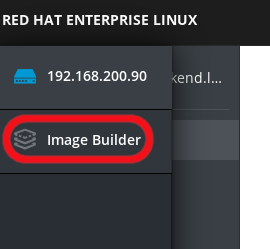

## Creating a blueprint

After login in the console and selecting the image build module we have to click on ``Create Blueprint``:

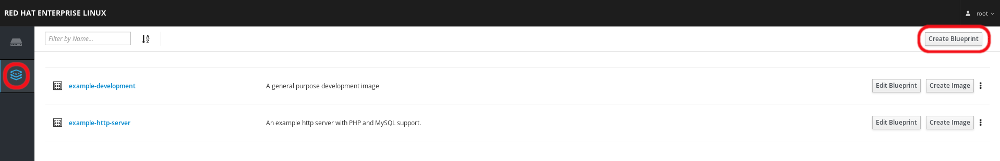

In the menu we fill the paramters:

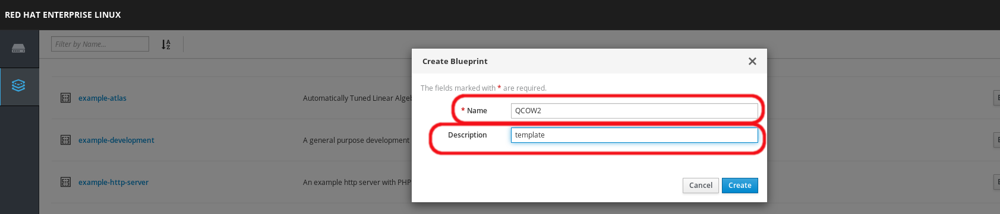

The next action is to include those components we want to be present, so we can use the selected text box to look for them:

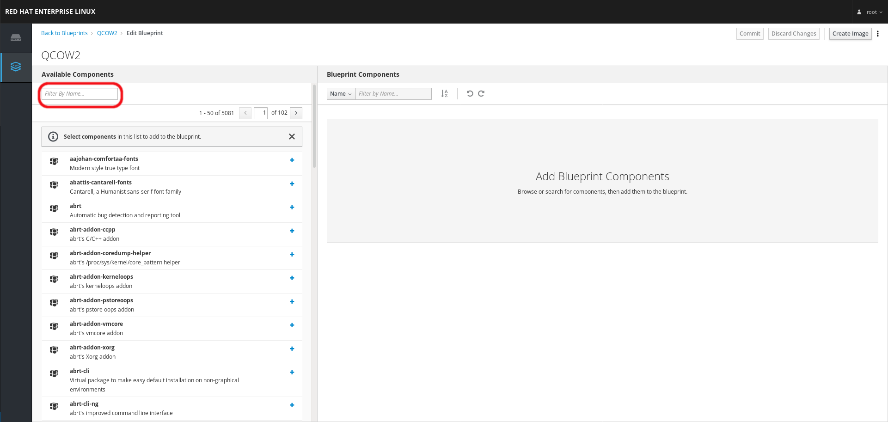

We can select all we need using the ``+`` and we can remove them using ``-``. When finish we need to click on ``Commit``:

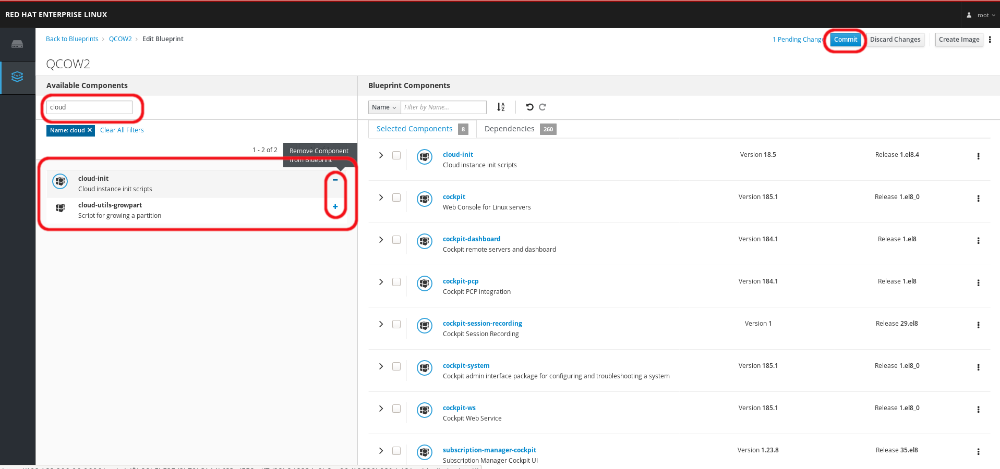

Confirm the changes if changes are ok clicking on ``Commit``:

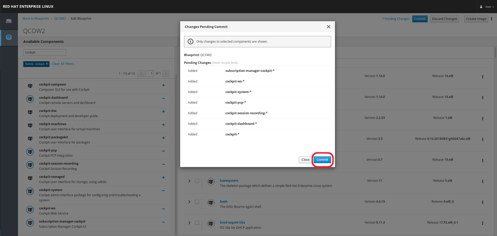

After we have informed that all change to the blueprint were commited we click on ``QCOW2``:

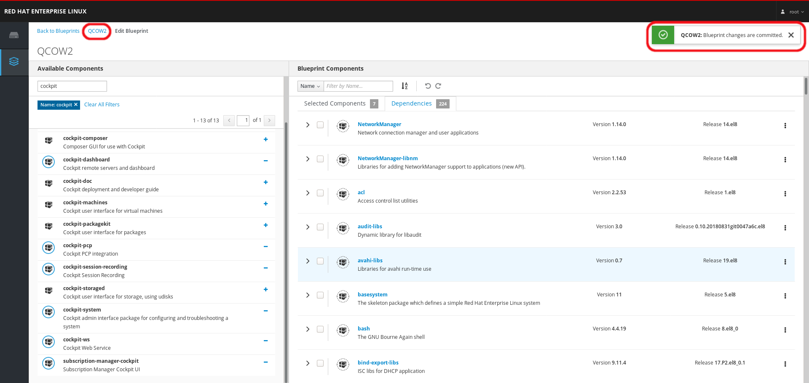

Now to create the image we have to click in ``Create Image``:

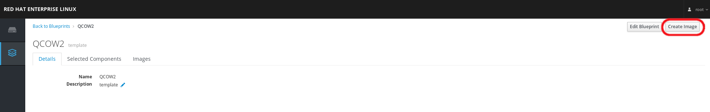

Select the type of image you want to create:

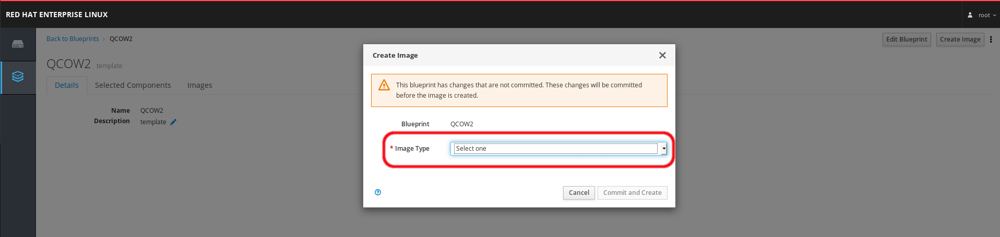

Click on ``Commit and Create`` to create the image:

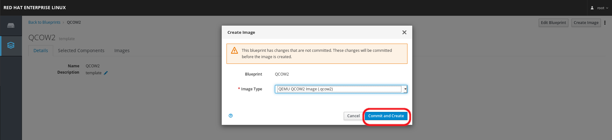

You will se confirmation:

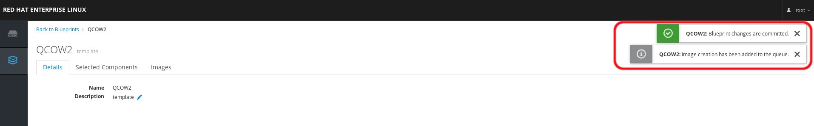

And if you go to the ``Images tab`` you can se the current state of the image:

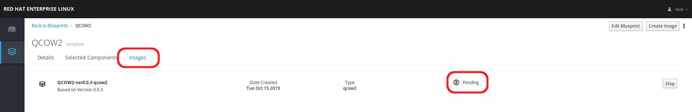

When the image is finished you can download it clicking on ``Download``:

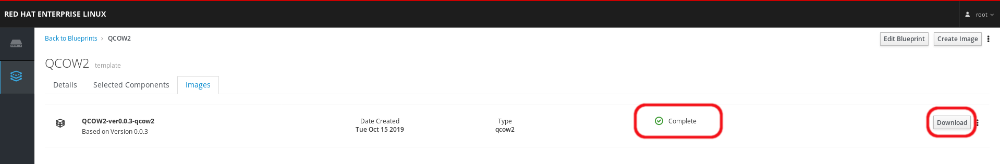

Save it:

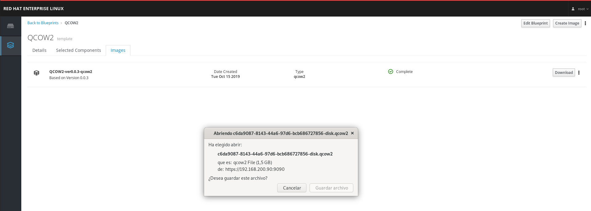
