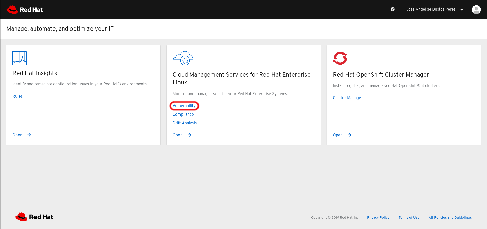
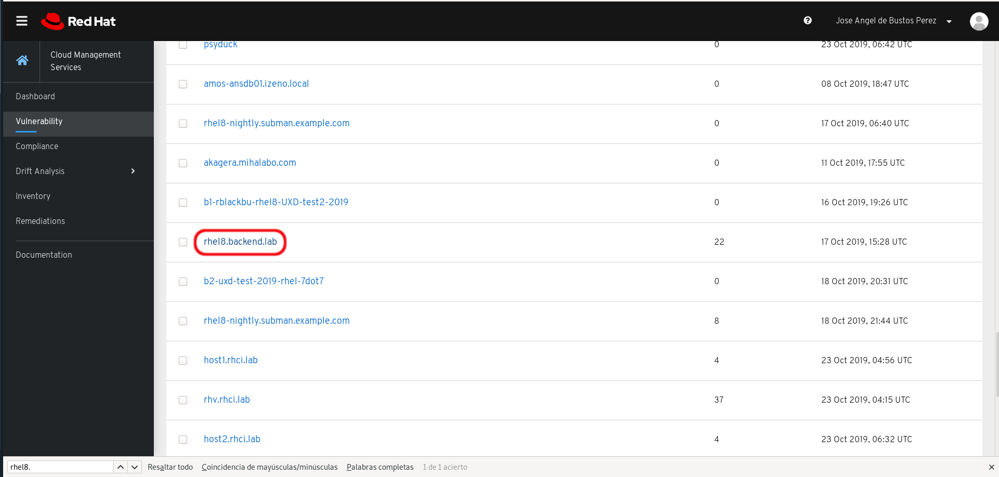
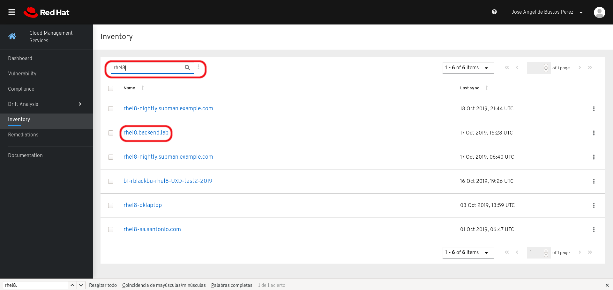
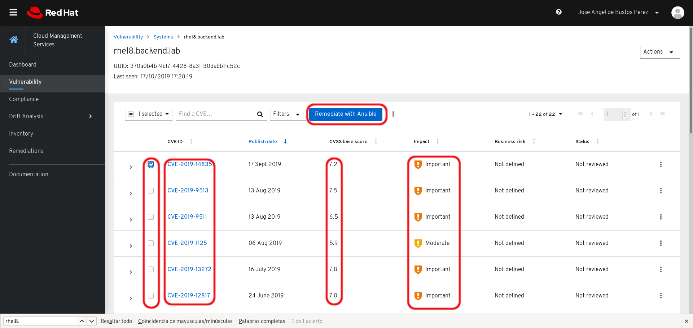
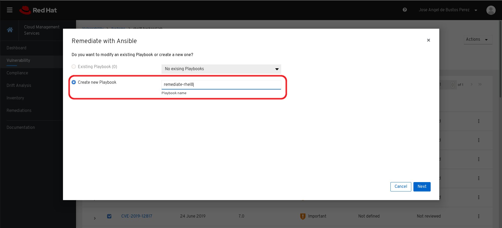
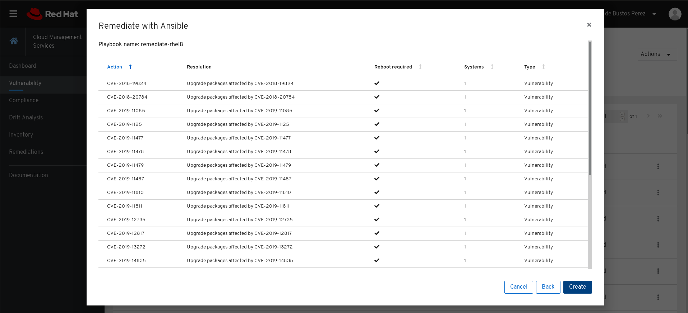
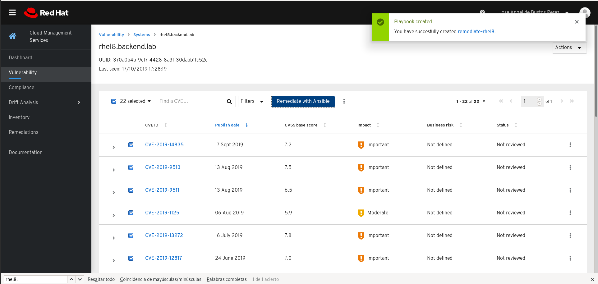
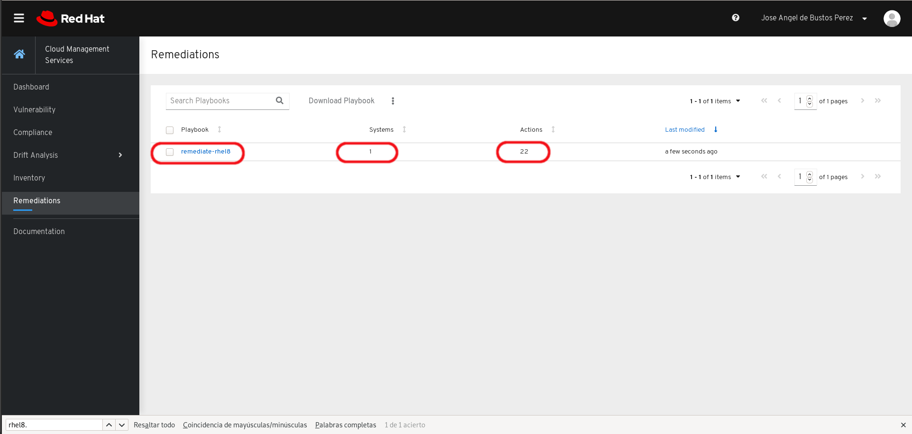
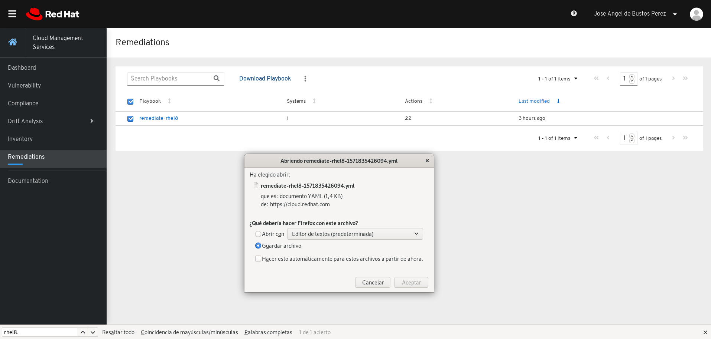

# Insights

Red Hat Insights is included with your Red Hat Enterprise Linux subscription. Though we announced that Insights was included with your RHEL subscription at the same time that  RHEL 8 was launched, we want to clarify that Insights is included with RHEL for supported RHEL versions that have the Insights client available. This is currently RHEL 6.10 and above, including RHEL 7 and RHEL 8 versions.

#  Lab

## Installing

You need to register the host against Red Hat CDN or Red Hat Satellite:

```bash
[root@rhel8 ~]# subscription-manager status
+-------------------------------------------+
   System Status Details
+-------------------------------------------+
Overall Status: Current

System Purpose Status: Not Specified

[root@rhel8 ~]# 
```

You need to install the ``insights-client``:

```bash
[root@rhel8 ~]# yum install insights-client
```

Register the node in insights:

```bash
[root@rhel8 ~]# insights-client --register
You successfully registered af3a5766-41bf-423c-8234-5a506f0ec5e0 to account 1460290.
Successfully registered host rhel8.backend.lab
Automatic scheduling for Insights has been enabled.
Starting to collect Insights data for rhel8.backend.lab
Uploading Insights data.
Successfully uploaded report from rhel8.backend.lab to account 1460290.
[root@rhel8 ~]# 
```

If we log into [https://cloud.redhat.com](https://cloud.redhat.com) with our credentials:



Clicking in ``Vulnerability`` we can see two tabs:

* **CVEs** where we can see CVEs.
* **Systems** where we can see our systems.



An easy way to locate servers is clicking inventory where we can search by name:



Clicking in one system we can see the CVEs that apply to that system and if we select some of them we can create an ansible playbook to remediate them:



Clicking in ``Remediate with Ansible`` a playbook to remediate the choosen CVEs will be created:



You can review the CVEs that will be included:



The playbook was succesfully created:



If we go to remediations we can see all the **remediations playbook** that we have created, unless deleted:



If we go to ``Remediations`` we can download the playbook:


