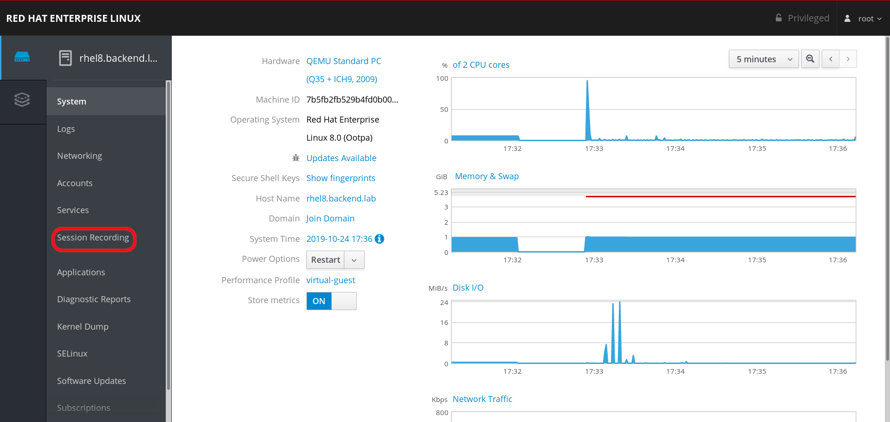
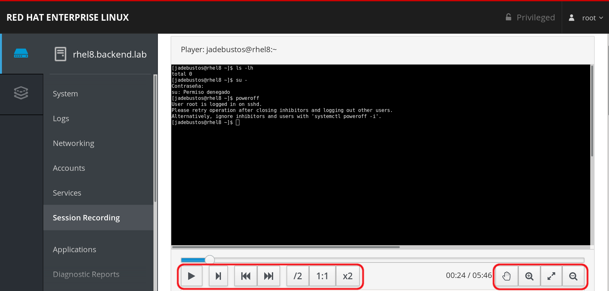

# Session recording

## Requirements

A host where you can ssh without password to the RHEL8's root user.

## Deploying the lab

To deploy the lab:

```bash
[root@hostname ansible]# ansible-playbook -i hosts prepare-rhel8-labs.yml --tags web_console,session_recording
```

## Deleting the lab

To delete the lab:

```bash
[root@hostname ansible]# ansible-playbook -i hosts reset-rhel8-labs.yml --tags session_recording
```

# Lab

## Installing session recording

You need to install **sssd** and **tlog** packages and if you want to use the web console you need to install it, start the web console and you will have to install the **cockpit-session-recording** package to be able to use it from the web console.

Let's assume that the web console is already installed:

```bash
[root@rhel8 ~]# dnf install sssd tlog cockpit-session-recoding -y 
```

After that we need to configure **SSSD**. For instance we can use this minimal configuration:

```bash
[root@rhel8 ~]# cat /etc/sssd/sssd.conf 
[domain/local]
id_provider = files

[sssd]
domains = local
services = nss, pam, ssh, sudo
[root@rhel8 ~]# 
```

SSSD daemon needs to be restarted if we have changed or modified configuration:

```bash
[root@rhel8 ~]# systemctl restart sssd
[root@rhel8 ~]# 
```

## Configuring session recording

Log into the web console:



Click on ``Session Recording``:


Click on ``Configuration`` and save **General Configuration**:


In **SSSD Configuration** change the scope:

* **None** no session recording configured.
* **Some** allows to you to configure session recording for specific users.
* **All** enables session recording for all users.

Save configuration when you change the scope to **All**:


From this point all session will be recordered.

## Reproducing a recordered session

Log using one user, for instance **jadebustos** users performe some tasks and close session.

When you log with a user which session will be recorderd you will be warned:

```bash
[jadebustos@jumphost ~]$ ssh jadebustos@192.168.200.90
-- WARNING -- This system is for the use of authorized users only. Individuals 
using this computer system without authority or in excess of their authority 
are subject to having all their activities on this system monitored and 
recorded by system personnel. Anyone using this system expressly consents to 
such monitoring and is advised that if such monitoring reveals possible 
evidence of criminal activity system personal may provide the evidence of such 
monitoring to law enforcement officials.

Activate the web console with: systemctl enable --now cockpit.socket

Last login: Thu Oct 24 11:48:49 2019 from 192.168.200.1
/usr/bin/xauth:  file /home/jadebustos/.Xauthority does not exist

ATTENTION! Your session is being recorded!

[jadebustos@rhel8 ~]$ 
```

Once you have done that we can reproduce the session in the web console or in the shell:


You could see all recordered sessions, click in the session you want to reproduce and you will have some information.

You can reproduce the session at different speeds, stop, resume ...



Scrolling down you can see information about the session:


Scrowlling down you can see log information related to user activity:


If we can do it in the shell we have to locate the id of the recordered session:

```bash
[root@rhel8 ~]# journalctl -o verbose | grep -i \"rec\"
    MESSAGE={"ver":"2.2","host":"rhel8.backend.lab","rec":"b5073361318348e4a139b6a0297a244f-259a-c289","user":"jadebustos","term":"xterm-256color","session":5,"id":1,"pos":0,"timing":"=238x53+53>45","in_txt":"","in_bin":[],"out_txt":"\u001b]0;jadebustos@rhel8:~\u0007[jadebustos@rhel8 ~]$ ","out_bin":[]}
    MESSAGE={"ver":"2.2","host":"rhel8.backend.lab","rec":"b5073361318348e4a139b6a0297a244f-259a-c289","user":"jadebustos","term":"xterm-256color","session":5,"id":2,"pos":10811,"timing":"=238x53>1+107>1+80>1+115>1+186>1+140>1+251>2+15>54+1732>1+64>1+167>1+164>1+279>2+70>12+2488>2+2621>67","in_txt":"","in_bin":[],"out_txt":"ls -lh\r\ntotal 0\r\n\u001b]0;jadebustos@rhel8:~\u0007[jadebustos@rhel8 ~]$ su -\r\nContraseña: \r\nsu: Permiso denegado\r\n\u001b]0;jadebustos@rhel8:~\u0007[jadebustos@rhel8 ~]$ ","out_bin":[]}
    MESSAGE={"ver":"2.2","host":"rhel8.backend.lab","rec":"b5073361318348e4a139b6a0297a244f-259a-c289","user":"jadebustos","term":"xterm-256color","session":5,"id":3,"pos":21842,"timing":"=238x53>1+288>1+173>1+133>1+607>1+255>1+138>1+144>1+90>2+53>230","in_txt":"","in_bin":[],"out_txt":"poweroff\r\nUser root is logged in on sshd.\r\nPlease retry operation after closing inhibitors and logging out other users.\r\nAlternatively, ignore inhibitors and users with 'systemctl poweroff -i'.\r\n\u001b]0;jadebustos@rhel8:~\u0007[jadebustos@rhel8 ~]$ ","out_bin":[]}
    MESSAGE={"ver":"2.2","host":"rhel8.backend.lab","rec":"b5073361318348e4a139b6a0297a244f-259a-c289","user":"jadebustos","term":"xterm-256color","session":5,"id":4,"pos":51913,"timing":"=238x53>1+140>1+113>1+112>1+269>1+84>1+104>1+283>1+414>1+878>1+185>1+522>1+380>2+12>108+715>1+124>1+90>1+76>1+225>1+175>1+94>1+177>2+358>1+127>1+115>1+139>1+482>1+154>1+373>4+132>4+238>1+142>1+245>1+406>2+5>81","in_txt":"","in_bin":[],"out_txt":"ls -lh /root\r\nls: no se puede abrir el directorio '/root': Permiso denegado\r\n\u001b]0;jadebustos@rhel8:~\u0007[jadebustos@rhel8 ~]$ cat /etc/shadwo\b\u001b[K\b\u001b[Kow\u0007\r\ncat: /etc/shadow: Permiso denegado\r\n\u001b]0;jadebustos@rhel8:~\u0007[jadebustos@rhel8 ~]$ ","out_bin":[]}
[root@rhel8 ~]# 
```
Then we can use the **tlog-play** command to reproduce it:

```bash
[root@rhel8 ~]# tlog-play -r journal -M TLOG_REC=b5073361318348e4a139b6a0297a244f-259a-c289
[jadebustos@rhel8 ~]$ ls -lh
total 0
[jadebustos@rhel8 ~]$ su -
Contraseña: 
su: Permiso denegado
[jadebustos@rhel8 ~]$ poweroff
User root is logged in on sshd.
Please retry operation after closing inhibitors and logging out other users.
Alternatively, ignore inhibitors and users with 'systemctl poweroff -i'.
[jadebustos@rhel8 ~]$ ls -lh /root
ls: no se puede abrir el directorio '/root': Permiso denegado
[jadebustos@rhel8 ~]$ cat /etc/shadow
cat: /etc/shadow: Permiso denegado
[jadebustos@rhel8 ~]$ logout

[root@rhel8 ~]# 
```

>  **INFORMATION**: All the information about sessions is stored in logs as any other information. When we reproduce a session no matter if it is in the web console or in the shell all information is recovered from the logs and played. There is no video recording and during reproduction the session is reproducted but commands are not issued again.